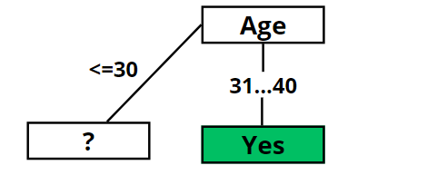
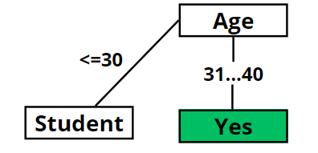
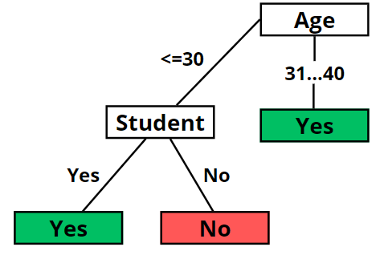
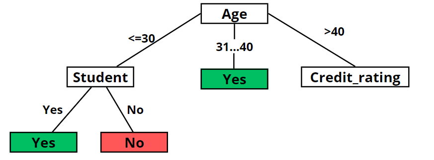
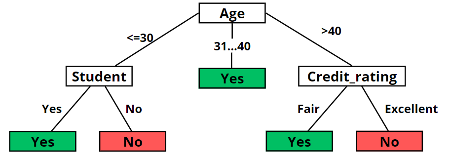

# Árboles de desición

A continuación se muestra la corrida en frío, con los todos los cálculos, del algoritmo de Mitchell. Concretamente, al elegir el mejor atributo para cada nueva raíz del árbol, se muestrán los cálculos de Entropía y Ganancia de Información de los ejemplos para cada valor del atributo tomado en consideración.

**Datos del conjunto iniciales**
| Datos    | Valores |
| -------- | ------- |
| \|S\|    | 14      |
| \|S+\|   | 9       |
| \|S-\|   | 5       |
| p+       | 0.6428  |
| p-       | 0.3571  |
| Entropia | 0.9402  |

Asi tenemos que la **entropia** del conjunto inicial es 0.9402.

Ahora se calculará la **ganancia** para cada atributo del conjunto inicial.

**Datos para el atributo "age"**
| Entropia A = (<=30) | Proporción A = (<=30) | Entropia A = (31...40) | Proporción A = (31...40) | Entropia A = (>40) | Proporción A = (>40) | Ganancia |
| ------------------- | --------------------- | ---------------------- | ------------------------ | ------------------ | -------------------- | -------- |
| 0.9709              | 0.3571                | 0                      | 0.2857                   | 0.9709             | 0.3571               | 0.2467   |

**Datos para el atributo "Income"**
| Entropia I = Low | Proporción I = Low | Entropia I = Medium | Proporción I = Medium | Entropia I = High | Proporción I = High | Ganancia |
| ---------------- | ------------------ | ------------------- | --------------------- | ----------------- | ------------------- | -------- |
| 0.8112           | 0.2857             | 0.9182              | 0.4285                | 1                 | 0.2857              | 0.0292   |

**Datos para el atributo "Student"**
| Entropia S = Yes | Proporción S = Yes | Entropia S = No | Proporción S = No | Ganancia |
| ---------------- | ------------------ | --------------- | ----------------- | -------- |
| 0.5916           | 0.5                | 0.9852          | 0.5               | 0.1518   |

**Datos para el atributo "Credit_rating"**
| Entropia Cr = Excellent | Proporción Cr = Excellent | Entropia Cr = Fair | Proporción Cr = Fair | Ganancia |
| ----------------------- | ------------------------- | ------------------ | -------------------- | -------- |
| 1                       | 0.4285                    | 0.8112             | 0.5714               | 0.0481   |

Dado que la ganacia del atributo **Age** es la más alta lo escogemos como nodo raíz. Teniendo como nuevo conjunto
a **Age = (<=30)**

Veamos ahora los datos del nuevo conjunto

**Datos del conjunto Age = (<=30)**
| Datos    | Valores |
| -------- | ------- |
| \|S\|    | 5       |
| \|S+\|   | 2       |
| \|S-\|   | 3       |
| p+       | 0.4     |
| p-       | 0.6     |
| Entropia | 0.9709  |

Ahora se calculará la **ganancia** para cada atributo del conjunto **Age = (<=30)** y quedando ordenado el conjunto **Age = 31...40**, ya que todos sus valores son *Yes*.

**Datos para el atributo "Income"**
| Entropia I = Low | Proporción I = Low | Entropia I = Medium | Proporción I = Medium | Entropia I = High | Proporción I = High | Ganancia |
| ---------------- | ------------------ | ------------------- | --------------------- | ----------------- | ------------------- | -------- |
| 0                | 0.2                | 1                   | 0.4                   | 0                 | 0.4                 | 0.5709   |

**Datos para el atributo "Student"**
| Entropia S = Yes | Proporción S = Yes | Entropia S = No | Proporción S = No | Ganancia |
| ---------------- | ------------------ | --------------- | ----------------- | -------- |
| 0                | 0.4                | 0               | 0.6               | 0.9709   |

**Datos para el atributo "Credit_rating"**
| Entropia Cr = Excellent | Proporción Cr = Excellent | Entropia Cr = Fair | Proporción Cr = Fair | Ganancia |
| ----------------------- | ------------------------- | ------------------ | -------------------- | -------- |
| 1                       | 0.4                       | 0.9182             | 0.6                  | 0.0199   |

Dado que la ganacia del atributo **Student** es la más alta lo escogemos como nodo.

Se escoge el conjunto **Student = Yes**, el cual esta ordenado, de igual forma ocurre con el conjunto **Student = No**.

Ahora se tiene como nuevo conjunto Teniendo como nuevo conjunto a **Age = (>40)**.

Veamos los datos del nuevo conjunto.

**Datos del conjunto Age = (>40)**
| Datos    | Valores |
| -------- | ------- |
| \|S\|    | 5       |
| \|S+\|   | 3       |
| \|S-\|   | 2       |
| p+       | 0.6     |
| p-       | 0.4     |
| Entropia | 0.9709  |

Ahora se calculará la **ganancia** para cada atributo del conjunto **Age = (>40)**

**Datos para el atributo "Income"**
| Entropia I = Low | Proporción I = Low | Entropia I = Medium | Proporción I = Medium | Ganancia |
| ---------------- | ------------------ | ------------------- | --------------------- | -------- |
| 1                | 0.4                | 0.9182              | 0.6                   | 0.0199   |

**Datos para el atributo "Student"**
| Entropia S = Yes | Proporción S = Yes | Entropia S = No | Proporción S = No | Ganancia |
| ---------------- | ------------------ | --------------- | ----------------- | -------- |
| 0.9182           | 0.6                | 1               | 0.4               | 0.0199   |

**Datos para el atributo "Credit_rating"**
| Entropia Cr = Excellent | Proporción Cr = Excellent | Entropia Cr = Fair | Proporción Cr = Fair | Ganancia |
| ----------------------- | ------------------------- | ------------------ | -------------------- | -------- |
| 0                       | 0.4                       | 0                  | 0.6                  | 0.9709   |

Dado que la ganacia del atributo **Credit_rating** es la más alta lo escogemos como nodo.

Se escoge el conjunto **Credit_rating = Excellent**, el cual esta ordenado, de igual forma ocurre con el conjunto **Credit_rating = Fair**.

Luego, el algoritmo termina.